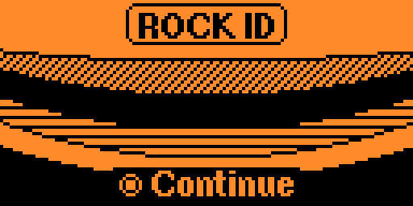
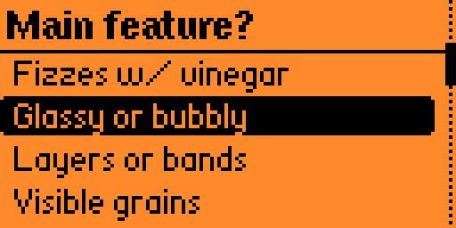
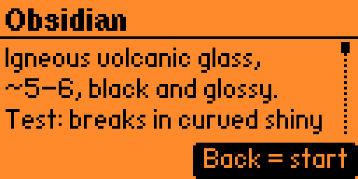

# Rock ID 🪨

A pocket rock-identification tool for the [Flipper Zero](https://flipperzero.one/).
Walk through a simple, field-usable key of yes/no questions and identify the most
common rocks you'll find outdoors — then read a mini field-guide entry for each one.

No internet, no phone, no geology degree required. Just you, a rock, and your Flipper.

## ✨ Features

- **Field-based dichotomous key** — answer simple questions about what you can
  actually see and test (fizz test, grain size, layering, luster…) and get to a
  result in a few taps.
- **Pocket encyclopedia** — every rock has a detailed entry:
  - **Test** — a confirmation test to be sure of the ID
  - **Find** — where you're likely to encounter it
  - **Vs** — common look-alikes and how to tell them apart
  - **Use** — what it's used for, plus a fun fact
- **21 common rocks** across sedimentary, igneous and metamorphic families.
- **Clean firmware-style UI** — highlighted selection, scrollbar, and a
  geological cross-section splash screen.
- **100% offline.**

## 🎮 Controls

| Screen        | Button        | Action                          |
|---------------|---------------|---------------------------------|
| Splash        | OK            | Start                           |
| Splash        | Back          | Exit                            |
| Key (menu)    | Up / Down     | Move selection                  |
| Key (menu)    | OK            | Choose answer                   |
| Key (menu)    | Back          | Previous question / splash      |
| Rock sheet    | Up / Down     | Scroll the entry                |
| Rock sheet    | Back          | Back to the start of the key    |

## 🪨 Rocks covered

**Sedimentary:** Chalk, Limestone, Fossil limestone, Sandstone, Conglomerate,
Shale, Mudstone, Flint / Chert, Coal
**Igneous:** Granite, Gabbro, Diorite, Basalt, Rhyolite, Obsidian, Pumice, Scoria
**Metamorphic:** Marble, Slate, Schist, Gneiss

## 📲 Installation

### From the Apps Catalog (recommended)
Once published, install it directly from **[Flipper Lab](https://lab.flipper.net/apps)**
or the Flipper mobile app — search for **Rock ID**.

### Build it yourself
Requires [ufbt](https://pypi.org/project/ufbt/):

    pip install ufbt
    git clone https://github.com/Coincoin-Dataduck/rock_id.git
    cd rock_id
    ufbt          # build the .fap
    ufbt launch   # build + install on a connected Flipper

The compiled `rock_id.fap` will be in `dist/`. Copy it to
`SD Card / apps / Tools /` on your Flipper if installing manually.

## 📸 Screenshots

| Splash | Key | Rock sheet |
|--------|-----|------------|
|  |  |  |

## ⚠️ Disclaimer

This app is an educational aid for **hobbyist rock identification** and may not be
accurate for every specimen. It is not a substitute for professional geological
analysis. Have fun and stay curious!

## 🙏 Credits

Vibe coded with Claude by **Coincoin-Dataduck**.

## 📜 License

Released under the MIT License. See [LICENSE](LICENSE) for details.
